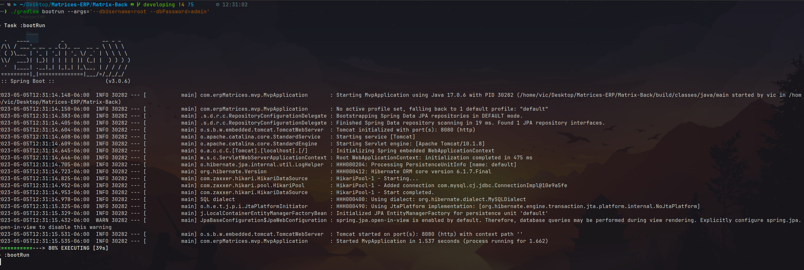
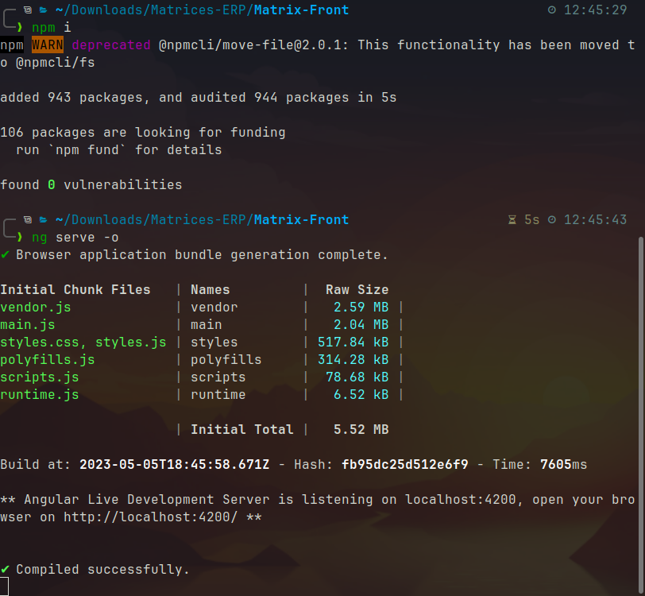
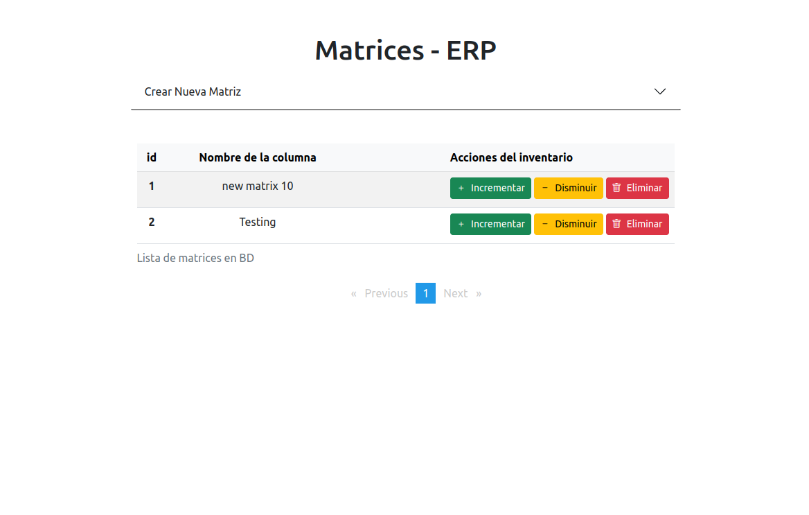
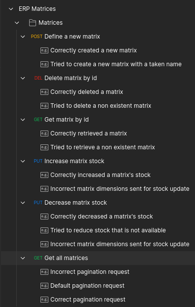
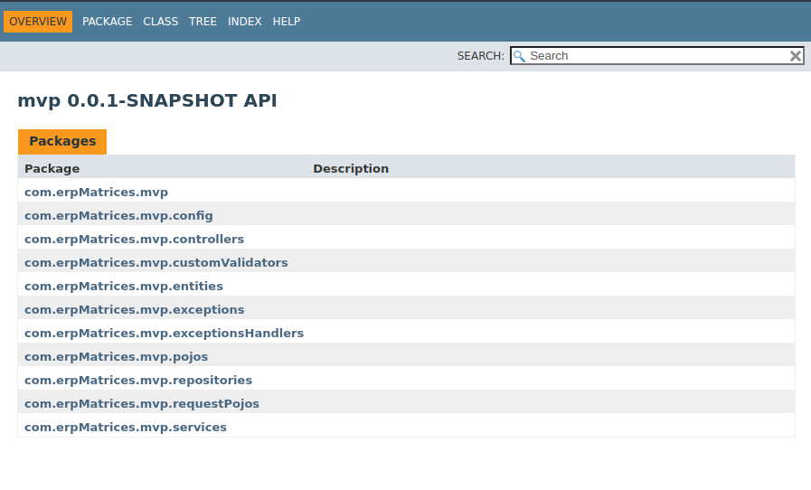
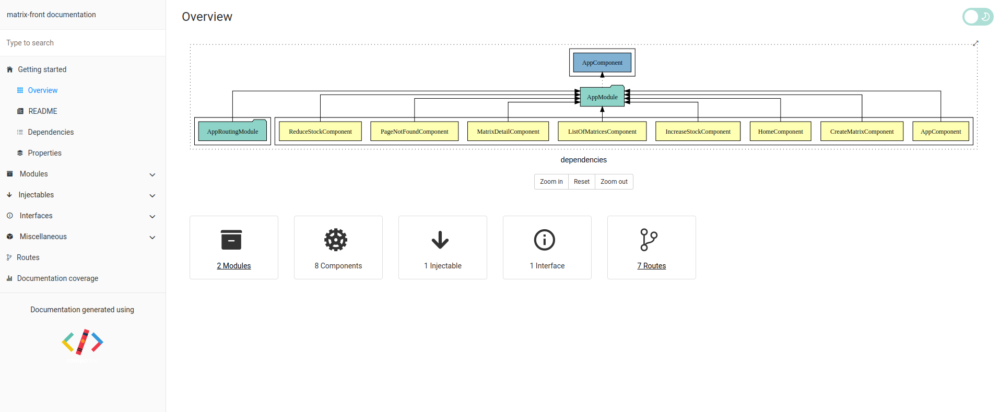

# Matrices-ERP


## Requisitos previos

Versiones con las que se trabajó:

- OpenJDK 17
- MySQL 8.0.32
- Node.js 18.14.2
- Angular CLI 15.2.6 
- Postman (10.13.5)
- Gradle (8.1.1)

------


## Instalación

### Configuración inicial

1. Clonar el repositorio

   ```bash
   git clone https://github.com/VictorLavalle/Matrices-ERP.git
   ```

   1.1 Moverse a la  carpeta del proyecto y a la rama `developing` (en caso de ser necesario)

   ```bash
   cd Matrices-ERP
   git checkout developing
   ```

   

2. Crear base de datos en MySQL con el nombre  ***erp_matrices***

   Puede ser creada manualmente con las siguientes propiedades (estándar):

   * **codificación**: utf8mb4

   * **collation**: utf8mb4_0900_ai_ci

     

   También puede ser creada copiando el contenido del script en una terminal o importandolo en un cliente de base de datos.
   El archivo se encuentra en la ruta: `Matrices-ERP/Resources/create-database.sql`

   ```sql
   CREATE DATABASE erp_matrices CHARACTER SET utf8mb4 COLLATE utf8mb4_0900_ai_ci;
   ```

------


### Backend

1. Ubicarse en la carpeta raíz (*Matrices-ERP*) y moverse a la carpeta **Matrix-Back**

   ```bash
   cd Matrix-Back/
   ```

   

2. Correr el proyecto desde línea de comando pasando los argumentos de usuario y contraseña de MySQL donde se creó la base de datos:

   ```bash
   ./gradlew bootrun --args='--dbUsername=root --dbPassword=admin'
   ```

   


​		*** Nota:** 

​		 	El proyecto corre por default en `localhost:8080` , si se desean cambiar, hacerlo en el archivo ***application.properties***.

​		 	En caso de ser cambiado, es necesario actualizarlo también en la colección de pruebas de postman.


## Frontend

1. Ubicarse en la carpeta raíz (*Matrices-ERP*) y Moverse a la carpeta **Matrix-Front**

   ```bash
   cd Matrix-Front/	
   ```


2.  Abrir una terminal o línea de comandos

   2.1 Instalar dependencias y bibliotecas

   ```bash
   npm i
   ```

   2.2 Correr proyecto en modo desarrollo 

   ```bash
   ng serve -o
   ```

   

   

   Se abrirá una ventana en el navegador:
   ***Nota:** esta vista es de ejemplo con matrices cargadas y creadas desde postman, al ejecutar la primera vez estará vacía la vista

   

## Testing

### Unit Testing

1. Cambiar la configuración de **application.properties**  para que puedan ser ejecutadas las pruebas sin problema

   ```bash
   spring.datasource.username=${dbUsername:username}
   spring.datasource.password=${dbPassword:password}
   ```

2. Correr las pruebas:

   ```bash
   ./gradlew clean test
   ```

   

### Postman

1. Localizar el archivo ***ERP Matrices.postman_collection.json***, se encuentra en la ruta: `Matrices-ERP/Resources/postman`
2. Abrir el cliente de Postman e importar el archivo para que genere una carpeta con las funciones de la matriz:
   

Cada una de las pruebas ya tiene precargadas la ruta, acciones, valores, parámetros y salidas correpondiente a cada método y propósito del mismo.

------


## Documentación

### Javadoc

* **Ruta**: Matrices-ERP/Matrix-Back/build/docs/javadoc/index.html

  

 ### Compodoc

**Ruta**: Matrices-ERP/Matrix-Front/documentation/index.html


